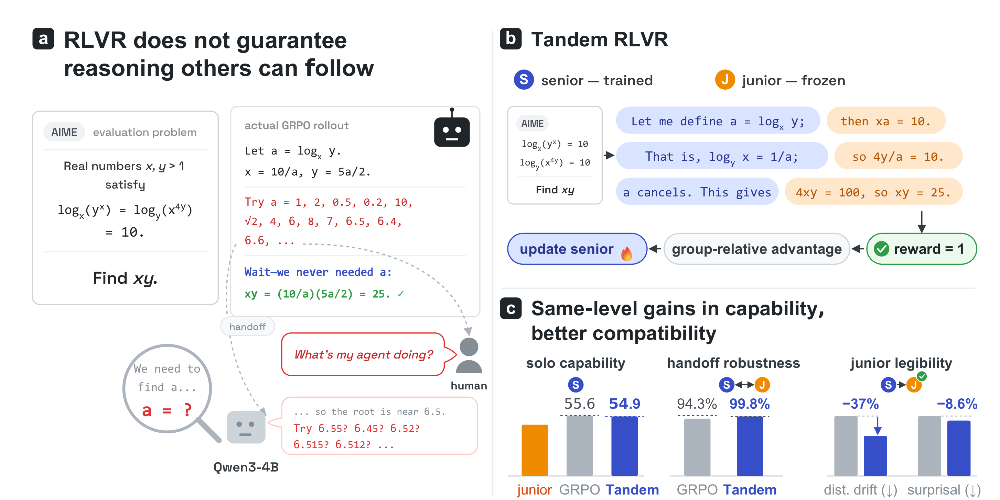

# Tandem Reinforcement Learning with Verifiable Rewards

[](https://arxiv.org/pdf/2606.28166) [](https://huggingface.co/difanjiao/TT-Word-Qwen3-4B-Instruct-2507-DeepScaleR)

RLVR raises a model's reasoning ability without any pressure to keep that reasoning legible to the
weaker models and people it has to work with. TRLVR changes one thing in the rollout: every rollout
is co-generated with a frozen junior, a copy of the senior's own pre-RL base, and the policy
gradient covers only the tokens the senior wrote. On competition math, the Tandem RLVR senior
matches GRPO in solo reasoning capability, retains nearly all of that capability when the junior
takes over half the reasoning, and expresses its reasoning in language the junior can follow.



## Install

Tandem rollout is a patch to vLLM and verl. `third_party/` holds the pinned upstream commits and
the two patches.

```bash
bash env/install.sh $HOME/envs/tandem-rlvr     # conda env and the core stack
bash third_party/apply_patches.sh              # clone both upstreams at the pins, apply the patches
```

Then build both forks into that environment, following `docs/INSTALL.md`, and check:

```bash
python env/smoke.py
```

## Train

```bash
cp train/env.sh.example train/env.sh           # then set the paths for your machine
python data/build_deepscaler.py                # writes train.parquet and heldout.parquet
```

```bash
bash train/tandem_grpo.sh                      # tandem rollout, senior only gradient
bash train/vanilla_grpo.sh                     # matched control
bash train/kl_reg.sh                           # ablation, KL_COEF required
bash train/grpo_g16.sh                         # ablation, control at 16 rollouts
```

Each is one job on two GPUs; the second card holds the frozen junior. Checkpoints land under
`${CKPT_ROOT}/${EXP_NAME}`, Hugging Face weights per save under `hf/global_step_N`. Training
validates on `data/deepscaler/heldout.parquet` and logs `val-core/macro_avg/acc/pass@4`; take the
step with the highest value. Details in `docs/REPRODUCING.md`.

## Evaluate

Three metrics, one script each, one JSON each.

| script | measures |
|---|---|
| `eval/solo.py` | the senior alone: pass@k over n independent samples per problem |
| `eval/handoff.py` | senior and junior alternating at every `\n\n`, one reasoning step each, under a shared token budget, with the team's answer graded |
| `eval/legibility.py` | the frozen junior's mean per-token cross-entropy, in nats, over the senior's chain of thought |

```bash
MODEL=$SENIOR TAG=step_120 RESULTS_ROOT=results/tandem bash eval/run_all.sh
```

Sampling is defined once, in `eval/config.py`. See `eval/README.md`.

## Citation

If you find this work useful, please cite:

```bibtex
@article{jiao2026tandem,
  title={Tandem Reinforcement Learning with Verifiable Rewards},
  author={Jiao, Difan and Singhal, Raghav and West, Robert and Anderson, Ashton},
  journal={arXiv preprint arXiv:2606.28166},
  year={2026}
}
```
